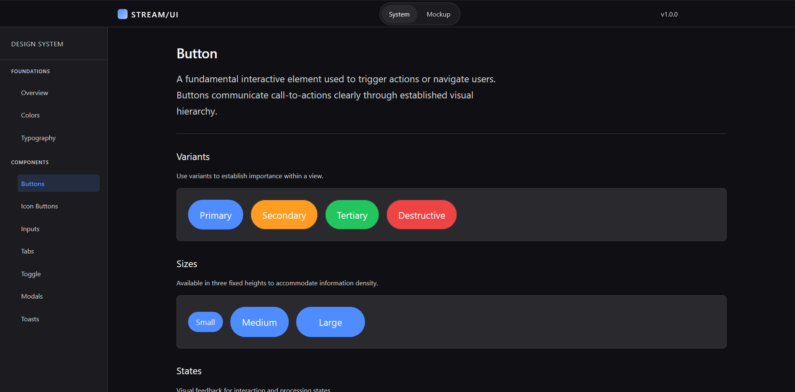

# 🎬 Accessibility-First Entertainment UI System (Stream/UI)

> A production-ready, WCAG 2.2 compliant Vue 3 component library and streaming interface mockup.



## 📖 The "Why" (For Hiring Managers & Decision Makers)

Streaming platforms and entertainment interfaces are highly visual, often relying on complex hover states, cinematic animations, and dense image grids. Unfortunately, these patterns frequently degrade the experience for users relying on screen readers, keyboards, or touch devices.

This project was built to answer a core engineering question: **How do we build a premium, cinematic user experience without sacrificing inclusivity?**

This repository serves as a dual-purpose proof of concept:

1. **The Design System:** A living documentation site detailing the atomic components, tokens, and rules.
2. **The Mockup:** A real-world application of the system, recreating complex streaming app views (Content Details, Playback Settings).

---

## ✨ Key Features & Architectural Highlights

### ♿ Accessibility (WCAG 2.2 AA)

Accessibility is treated as a core architectural pillar, not an afterthought.

* **Semantic ARIA Patterns:** Components like the `ToggleSwitch` use `<button role="switch">` over native checkboxes to provide immediate-action mental models for screen readers.
* **Guaranteed Tap Targets:** A global SCSS `@mixin tap-target` ensures all interactive elements (even visually small icon buttons) hit the strict **44x44px minimum** touch target rule.
* **Keyboard Navigation:** Custom `:focus-visible` offset rings ensure high visibility for keyboard users, while Skip Links (`SkipLink.vue`) bypass heavy navigational blocks.
* **Screen Reader Optimization:** Decorative icons are explicitly hidden (`aria-hidden="true"`), while visual UI controls have explicitly linked `aria-labelledby` IDs.

### 📐 Robust SCSS Architecture (ITCSS)

The styling layer is completely custom, leveraging the **Inverted Triangle CSS (ITCSS)** methodology to prevent specificity wars and global side effects.

* **Fluid Scales:** Spacing and typography utilize mathematical Sass maps and CSS `clamp()`, dynamically shrinking and growing based on viewport size without excessive media queries.
* **Semantic Theming:** Colors are mapped to semantic variables (e.g., `--color-surface-raised` instead of `--gray-800`), allowing seamless integration of future Light/Dark themes.
* **Layered Elevation:** Instead of flat drop-shadows, components like `MovieCard` use a custom layered shadow system combined with cinematic `cubic-bezier` timings to create high-end depth.

### 🛠 Modern Vue 3 Ecosystem

* **Framework:** Vue 3 using the Composition API (`<script setup>`).
* **Tooling:** Vite for lightning-fast HMR and global SCSS auto-injection.
* **Type Safety:** Strict TypeScript interfaces for component props, ensuring predictable and reliable data flow.
* **Component Design:** Atomic design principles (Atoms, Molecules, Organisms, Layouts).

---

## 🏗 Notable Components

### 1. The `ToggleSwitch` Atom

A custom toggle switch designed for immediate settings updates (e.g., "Autoplay Next Episode").

* **Decision:** Uses `<button role="switch">` because it alters state instantly (unlike form submission checkboxes).
* **A11y:** Includes manual ID linking to ensure `<label>` clicks trigger the button, and screen readers read the full context.

### 2. The `MovieCard` Pattern

A dense, visually appealing content card.

* **Decision:** Replaced arbitrary media query resizing with CSS Grid `auto-fill` and `minmax()` limits.
* **A11y:** Text is governed by `-webkit-line-clamp` to prevent long titles from breaking the grid, while the focus state elevates the card above siblings via `z-index` mapping.

### 3. The `Tabs` Molecule

A completely stateless, context-injected tab layout (`TabsRoot`, `TabsList`, `TabsTrigger`, `TabsContent`).

* **Decision:** Uses Vue's `provide/inject` pattern to pass the active state down, preventing prop-drilling.
* **A11y:** Complete ARIA tablist specification (`role="tab"`, `role="tabpanel"`, `aria-selected`, `tabindex` management).

---

## 🚀 Getting Started

To run this project locally and explore the Design System and Mockup views:

### Prerequisites

* Node.js (v18+)
* npm

### Installation

1. Clone the repository:

```bash
git clone https://github.com/yourusername/accessibility-first-entertainment-ui-system.git
cd accessibility-first-entertainment-ui-system

```

1. Install dependencies:

```bash
npm install

```

1. Start the development server:

```bash
npm run dev

```

1. Open your browser and navigate to:

* **Design System:** `http://localhost:5173/system/components/button`
* **Mockup View:** `http://localhost:5173/mockup/content`

---

## 📂 Project Structure

```text
src/
├── components/          # Vue Components
│   ├── atoms/           # BaseButton, Icon, IconButton, ToggleSwitch, etc.
│   ├── molecules/       # Tabs (Root, List, Trigger, Content)
│   ├── organisms/       # SkipLink
│   ├── patterns/        # MovieCard
│   └── layout/          # AppShell, SystemLayout, MockupLayout
├── pages/               # Route Views
│   ├── mockup/          # Real-world app views (Content Details, Settings)
│   └── system/          # Design System documentation views
├── router/              # Vue Router configuration
├── styles/              # ITCSS Architecture
│   ├── settings/        # Design tokens, fluid scales, color variables
│   ├── tools/           # Mixins, breakpoints, map getters
│   ├── generic/         # Resets, box-sizing
│   └── base/            # Unclassed HTML element styling
└── main.ts              # App entry point

```

---

*Designed and developed to prove that great UI and great accessibility are not mutually exclusive.*
